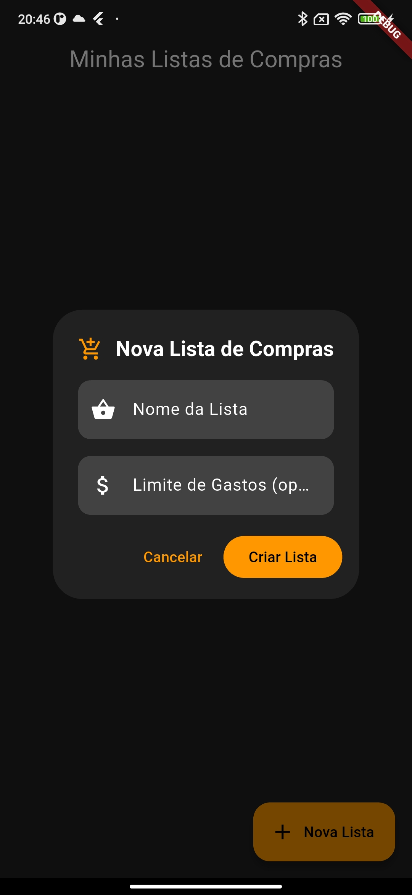
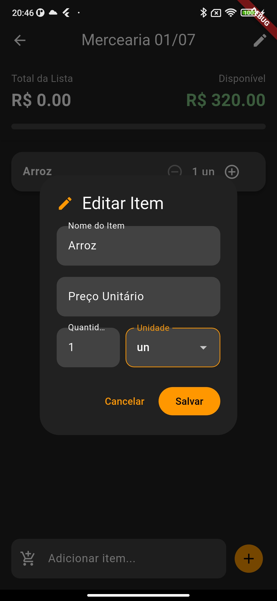

# Lista compras

Aplicativo mobile desenvolvido como projeto de estudo.

## Problema

Gerir os gastos nas compras sem que ultrapassem o teto de gastos.

## Solução

Desenvolvimento de um aplicativo que facilita o controle da lista de compras, permitindo que adicione um teto de gasto e um preço a cada item adicionado.

## Funcionalidades

- Cadastro de lista
- Edição de lista
- Remoção de lista
- Consulta de lista
- Adicionar item em uma lista
- Edição de item da lista
- Remoção de item da lista

## Screenshots

<p align="center">
  
  
  
  
</p>

## Tecnologias

- Flutter
- Hive

## Como executar

### Limpar os arquivos de builds

 ```sh
 flutter clean
 ```

### Baixar e resolver as dependências

```sh
flutter pub get
```

### Rodar o projeto no dispositivo

```sh
flutter run
```

### Requisitos

- flutter
- Android Studio
- Android SDK
